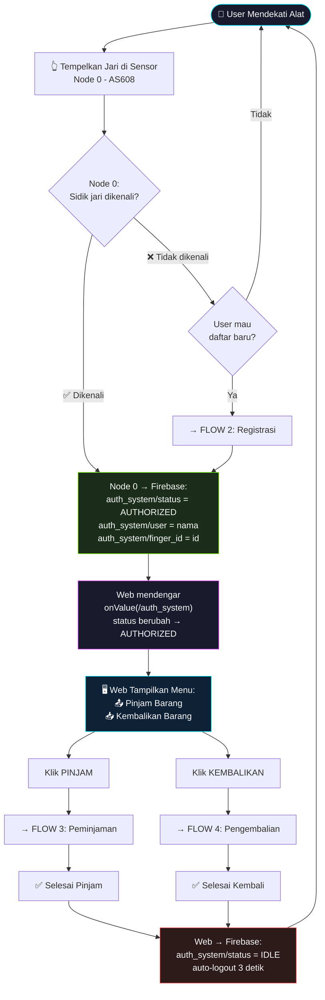
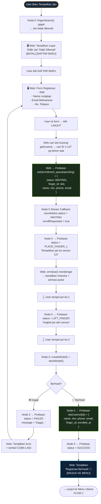
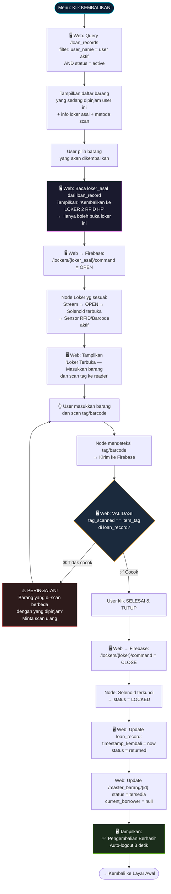
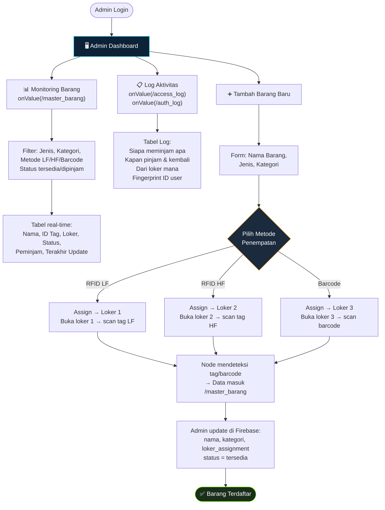
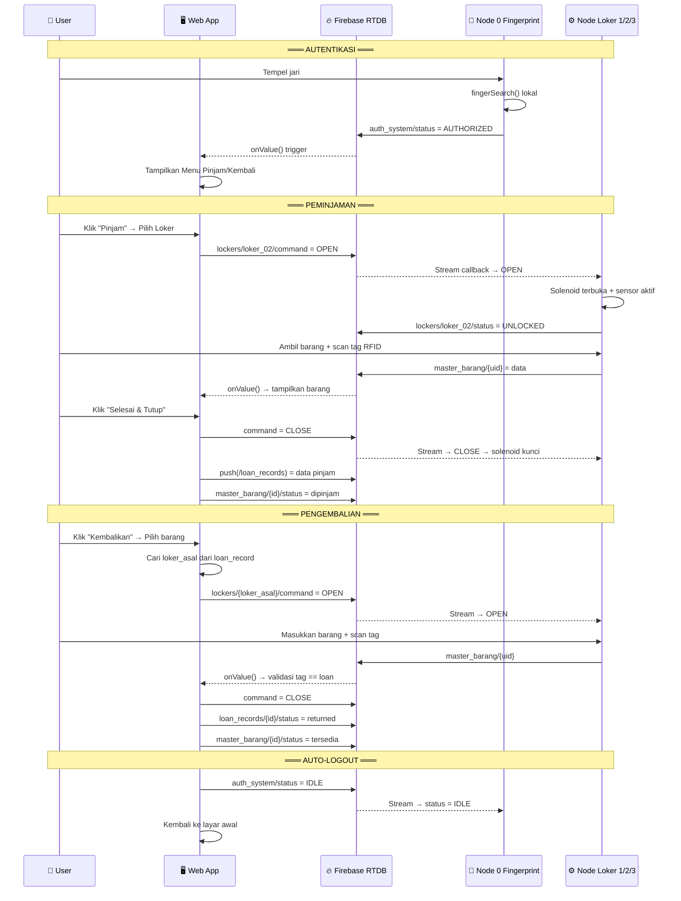

# 🗺️ Flowchart Lengkap — Web × Hardware × Firebase
## Sistem Peminjaman & Pengembalian Barang IoT Inventory

> **Tujuan dokumen ini**: Menjadi "peta jalan" untuk vibe coding. Setiap flowchart di bawah merepresentasikan satu fitur/halaman yang harus dibangun di web, beserta interaksi ke hardware (Node 0-3) dan Firebase RTDB.

---

## 📦 Struktur Firebase RTDB (Target Akhir)

```
firebase-rtdb/
├── auth_system/
│   ├── status: "IDLE" | "AUTHORIZED"
│   ├── user: "Raihan"
│   ├── finger_id: "3"
│   └── mode: "SCAN" | "ENROLL"
│
├── enrollment_queue/pending/
│   ├── status: "WAITING"|"PLACE_FINGER_1"|"SUCCESS"|"FAILED"
│   ├── finger_id: 3
│   ├── name, nim, phone, email
│   └── message: "..."
│
├── users/
│   └── {finger_id}/
│       ├── name, nim, phone, email, finger_id
│       ├── enrolled_at: "2026-05-15 10:00:00"
│       └── active: true
│
├── master_barang/
│   └── {tag_id atau barcode}/
│       ├── nama: "Multimeter Digital"
│       ├── kategori: "Alat Ukur"
│       ├── tipe: "RFID_LF" | "RFID_HF" | "BARCODE"
│       ├── tag_id: "AA:BB:CC:DD"
│       ├── loker_assignment: "loker_02"
│       ├── status: "tersedia" | "dipinjam"
│       ├── current_borrower: null | "Raihan"
│       └── registered_by: "Admin"
│
├── loan_records/
│   └── {push_id}/
│       ├── user_id: "3"
│       ├── user_name: "Raihan"
│       ├── item_id: "AA:BB:CC:DD"
│       ├── item_name: "Multimeter"
│       ├── loker_asal: "loker_02"
│       ├── metode: "RFID_HF"
│       ├── timestamp_pinjam: "2026-05-15 10:30:00"
│       ├── timestamp_kembali: null
│       └── status: "active" | "returned"
│
├── lockers/
│   └── loker_01/ loker_02/ loker_03/
│       ├── status: "LOCKED" | "UNLOCKED"
│       ├── command: "OPEN" | "CLOSE"
│       ├── user: "Raihan"
│       ├── last_uid: "AA:BB:CC:DD"
│       └── updated_at: "..."
│
├── access_log/ (push)
│   └── {id}/ → loker, user, action, uid, item, timestamp
│
└── auth_log/ (push)
    └── {id}/ → user, finger_id, timestamp
```

---

## 🔄 FLOW 1 — Alur Utama Keseluruhan Sistem



---

## 🔄 FLOW 2 — Registrasi Mahasiswa Baru



---

## 🔄 FLOW 3 — Peminjaman Barang

```mermaid
flowchart TD
    A([Menu: Klik PINJAM]) --> B["🖥️ Web: Baca /lockers/* dan /master_barang/*\nTampilkan daftar 3 loker + isi barangnya"]

    B --> C["User lihat isi loker\n(nama barang, kategori, status)"]
    C --> D["User pilih barang\nyang ingin dipinjam"]

    D --> E["🖥️ Web → Firebase:\n/lockers/loker_XX/command = OPEN"]

    E --> F["Node Loker (1/2/3)\nStream callback: command = OPEN\n→ digitalWrite(RELAY, HIGH)\n→ Solenoid terbuka"]

    F --> G["Node → Firebase:\n/lockers/loker_XX/status = UNLOCKED"]
    G --> H["🖥️ Web mendeteksi UNLOCKED\nTampilkan: 'Loker Terbuka 🔓\nSilakan ambil barang dan scan tag'"]

    H --> I["👆 User ambil barang\ndan scan tag RFID/Barcode\ndi reader pada loker"]

    I --> J["Node Loker mendeteksi tag/barcode\nBaca UID / barcode string"]
    J --> K["Node → Firebase:\nSimpan ke /master_barang/{id}\natau update data barang"]

    K --> L["🖥️ Web: onValue() mendeteksi\nbarang terdeteksi\n→ Tampilkan: '✅ ESP32 DevKit (AA:BB:CC:DD)'"]

    L --> M["User klik SELESAI & TUTUP"]
    M --> N["🖥️ Web → Firebase:\n/lockers/loker_XX/command = CLOSE"]

    N --> O["Node Loker:\ncommand = CLOSE\n→ Solenoid terkunci"]
    O --> P["Node → Firebase:\nstatus = LOCKED"]

    P --> Q["🖥️ Web: Catat Peminjaman\npush(/loan_records) = {\n  user_name, item_id, item_name,\n  loker_asal, metode, timestamp_pinjam,\n  status: active\n}"]

    Q --> R["Web: Update /master_barang/{id}\nstatus = dipinjam\ncurrent_borrower = nama user"]

    R --> S["🖥️ Tampilkan:\n'✅ Peminjaman Berhasil'\nAuto-logout 3 detik"]
    S --> T([→ Kembali ke Layar Awal])

    style A fill:#0d2137,stroke:#00e5ff,color:#fff
    style E fill:#1a1a2e,stroke:#e040fb,color:#fff
    style F fill:#1b2d1b,stroke:#76ff03,color:#fff
    style Q fill:#1b2a3d,stroke:#ff9800,color:#fff
    style S fill:#2d1b1b,stroke:#ff5252,color:#fff
```



---

## 🔄 FLOW 4 — Pengembalian Barang (Guided Return)



---

## 🔄 FLOW 5 — Admin: Monitoring & Tambah Barang



---

## 🔄 FLOW 6 — Komunikasi Realtime Web ↔ Firebase ↔ Hardware



---

## 🏗️ Mapping: Halaman Web yang Harus Dibuat

| # | Halaman/Komponen | Firebase Path yang Digunakan | Fungsi |
|---|-----------------|------------------------------|--------|
| 1 | **Layar Idle** | `onValue(/auth_system)` | Menunggu fingerprint, deteksi AUTHORIZED |
| 2 | **Form Registrasi** | `set(/enrollment_queue/pending)`, `onValue()` | Input NIM/Nama/Email/Telp → trigger Node 0 |
| 3 | **Menu Utama** | `get(/loan_records)` filter user | Tampilkan Pinjam / Kembalikan |
| 4 | **Halaman Pinjam** | `get(/master_barang)`, `get(/lockers)` | Pilih loker → lihat isi → buka loker |
| 5 | **Halaman Scan Aktif** | `set(/lockers/*/command)`, `onValue(/master_barang)` | Loker terbuka, tunggu scan, tampilkan hasil |
| 6 | **Halaman Kembalikan** | `get(/loan_records)` filter active | Daftar barang dipinjam → guided return |
| 7 | **Layar Sukses** | `set(/auth_system/status, IDLE)` | Konfirmasi + auto-logout 3 detik |
| 8 | **Admin Dashboard** | `onValue(/master_barang)`, `onValue(/access_log)` | Monitoring, log, tambah barang |

---

## 📌 Catatan Penting untuk Coding

### Yang Sudah Ada (Tidak Perlu Diubah)
- ✅ Node 0 firmware: scan jari, enrollment, write `/auth_system`
- ✅ Node 1/2/3 firmware: stream `/lockers/*/command`, buka/kunci solenoid, scan RFID/barcode
- ✅ Firebase config & anonymous auth

### Yang Harus Dibangun di Web
- 🔨 Alur Pinjam/Kembalikan (FLOW 3 & 4)
- 🔨 Validasi barang saat pengembalian (tag matching)
- 🔨 `loan_records` — pencatatan transaksi pinjam/kembali
- 🔨 Update `master_barang/{id}/status` saat pinjam/kembali
- 🔨 Auto-logout setelah transaksi selesai
- 🔨 Admin panel: monitoring + tambah barang + log

### Firebase Listener yang Dibutuhkan Web
```javascript
// 1. Auth status (sudah ada)
onValue(ref(db, "/auth_system"), callback)

// 2. Status loker (sudah ada)
onValue(ref(db, "/lockers/loker_XX"), callback)

// 3. Deteksi barang baru discan (BARU)
onValue(ref(db, "/master_barang"), callback)

// 4. Loan records untuk user aktif (BARU)
onValue(ref(db, "/loan_records"), callback)
```
